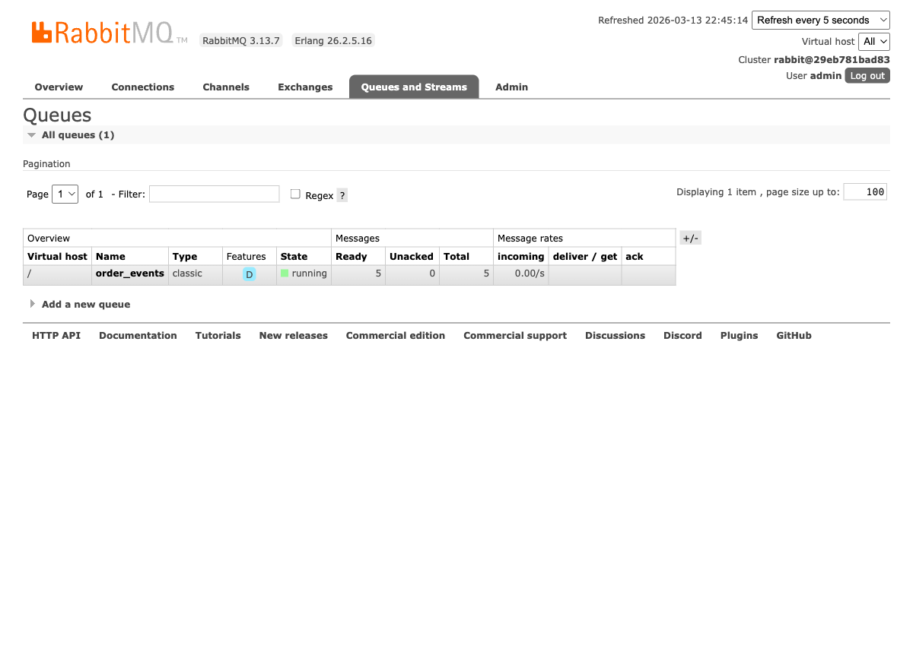
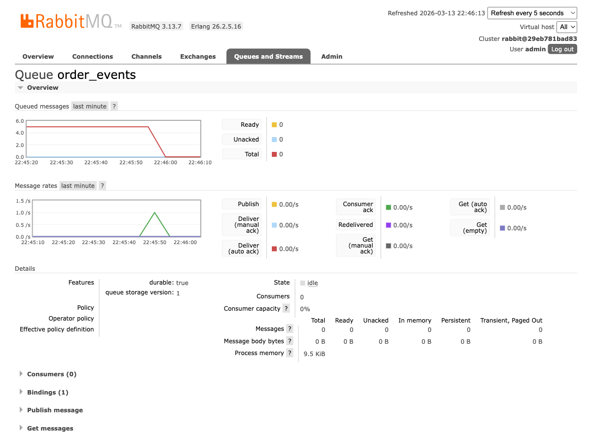

# Assignment A02 — Workload Design

**Nama:** Muttaqin Muzakkir
**NPM:** 2306207101
**Mata Kuliah:** Arsitektur Aplikasi Web (AAW)

---

## Deskripsi Sistem

Sistem event-driven sederhana untuk **pemrosesan order** menggunakan **RabbitMQ** sebagai message broker. Sistem terdiri dari:

- **Producer** (`order_producer.py`) — mengirimkan event order (JSON) ke queue RabbitMQ
- **Consumer** (`order_consumer.py`) — menerima dan memproses event order secara real-time
- **RabbitMQ** — message broker yang menyimpan event di queue `order_events`

### Arsitektur

```
┌──────────────┐       ┌─────────────┐       ┌──────────────┐
│   Producer   │──────▶│  RabbitMQ   │──────▶│   Consumer   │
│              │ JSON  │   Queue:    │ JSON  │              │
│ Sends order  │ event │order_events │ event │ Processes    │
│ events       │       │  (durable)  │       │ orders       │
└──────────────┘       └─────────────┘       └──────────────┘
```

Setiap order event berisi data JSON:
```json
{"order_id": 1, "item": "Laptop", "quantity": 1, "price": 15000000}
```

---

## Cara Menjalankan

### 1. Jalankan Docker Compose

```bash
docker compose up -d
```

Ini akan menjalankan RabbitMQ (beserta Kafka dan MySQL yang digunakan di tutorial).

### 2. Install dependency Python

```bash
pip install pika
```

### 3. Jalankan Producer

```bash
python rabbitmq/order_producer.py
```

Producer akan mengirim 5 order event ke queue `order_events`.

### 4. Jalankan Consumer

```bash
python rabbitmq/order_consumer.py
```

Consumer akan membaca dan memproses semua order event dari queue.

---

## Demo & Bukti

### 1. Producer Mengirim Events

Producer mengirim 5 order event ke queue RabbitMQ:

```
[Producer] Sending 5 order events to queue 'order_events'...

[Producer] Sent order #1: Laptop x1 @ Rp15,000,000
[Producer] Sent order #2: Mouse x2 @ Rp250,000
[Producer] Sent order #3: Keyboard x1 @ Rp750,000
[Producer] Sent order #4: Monitor x1 @ Rp4,500,000
[Producer] Sent order #5: Headset x3 @ Rp500,000

[Producer] All 5 order events sent successfully.
```

### 2. Dashboard — Queue Berisi 5 Pesan (Sebelum Consumer)

Setelah producer selesai mengirim, dashboard RabbitMQ menunjukkan queue `order_events` memiliki 5 pesan Ready:



### 3. Consumer Memproses Events

Consumer membaca dan memproses semua order event secara real-time:

```
[Consumer] Waiting for order events on queue 'order_events'...
[Consumer] Press CTRL+C to exit.

[Consumer] Processing order #1: Laptop x1 = Rp15,000,000
[Consumer] Processing order #2: Mouse x2 = Rp500,000
[Consumer] Processing order #3: Keyboard x1 = Rp750,000
[Consumer] Processing order #4: Monitor x1 = Rp4,500,000
[Consumer] Processing order #5: Headset x3 = Rp1,500,000

[Consumer] Processed 5 orders. Total revenue: Rp22,250,000
```

### 4. Dashboard — Queue Kosong (Setelah Consumer)

Setelah consumer memproses semua pesan, queue kembali kosong (Ready=0). Grafik menunjukkan penurunan dari 5 ke 0:



---

## Mekanisme Komunikasi Asynchronous vs Request-Response

### Komunikasi Asynchronous (Event-Driven)

Pada sistem ini, producer dan consumer **tidak perlu aktif secara bersamaan**. Producer mengirim event ke queue dan langsung selesai (fire-and-forget) — tidak perlu menunggu consumer memproses event tersebut. Event disimpan di queue RabbitMQ sampai ada consumer yang mengambilnya.

Karakteristik:
- **Loose coupling** — producer tidak perlu tahu siapa consumer-nya
- **Non-blocking** — producer tidak menunggu respons
- **Durable** — event tetap tersimpan di queue meskipun consumer belum aktif
- **Scalable** — bisa menambah consumer untuk memproses event secara paralel

### Komunikasi Request-Response (Synchronous)

Pada komunikasi request-response (misalnya REST API), client mengirim request dan **harus menunggu** sampai server mengembalikan response. Client terblokir selama menunggu.

Karakteristik:
- **Tight coupling** — client harus tahu endpoint server
- **Blocking** — client menunggu response sebelum melanjutkan
- **Tidak tahan gangguan** — jika server down, request gagal langsung
- **Sederhana** — mudah dipahami dan di-debug

### Perbandingan

| Aspek | Asynchronous (Event-Driven) | Request-Response |
|-------|---------------------------|-----------------|
| Coupling | Loose (via message broker) | Tight (direct connection) |
| Blocking | Non-blocking | Blocking |
| Ketahanan | Event tersimpan di queue jika consumer down | Request gagal jika server down |
| Skalabilitas | Tinggi (tambah consumer) | Terbatas (tambah server) |
| Kompleksitas | Lebih kompleks (perlu message broker) | Lebih sederhana |
| Use case | Event processing, notifikasi, background jobs | CRUD operations, query data |

---

## Asumsi & Keputusan Implementasi

- Menggunakan **RabbitMQ** (bukan Kafka) karena lebih sederhana untuk demonstrasi event-driven system dengan queue semantics
- RabbitMQ dijalankan via **Docker Compose** (bukan instalasi langsung) untuk kemudahan setup
- Queue dikonfigurasi sebagai **durable** agar event tidak hilang jika RabbitMQ restart
- Consumer menggunakan **manual acknowledgment** (`basic_ack`) untuk memastikan event hanya dihapus dari queue setelah berhasil diproses
- Data order menggunakan format **JSON** sebagai format event yang umum digunakan

---

## Penggunaan AI

Dalam pengerjaan tugas ini, **Claude Code** (CLI tool dari Anthropic) digunakan sebagai alat bantu untuk mempercepat penulisan boilerplate code dan penyusunan dokumentasi README.
